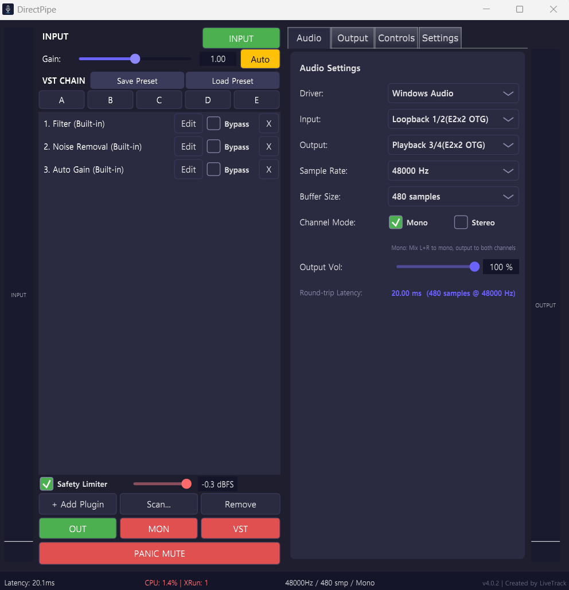

<p align="center">
  
</p>

<p align="center">
  
  
  
  
  
</p>

Windows용 실시간 VST2/VST3 호스트. 마이크 입력에 VST 플러그인 체인을 걸어 실시간으로 처리하고, 메인 출력(AudioSettings Output 장치)으로 직접 전송한다. 별도 WASAPI 장치를 통한 모니터 출력(헤드폰)도 지원. Light Host와 비슷하지만 키보드 단축키 / MIDI CC / Stream Deck / HTTP API를 통한 외부 제어와 빠른 프리셋 전환에 초점을 맞추었다.

Real-time VST2/VST3 host for Windows. Processes microphone input through a VST plugin chain, with main output going directly to the AudioSettings Output device. Optional separate WASAPI monitor output for headphones. Similar to Light Host, but focused on external control (hotkeys, MIDI CC, Stream Deck, HTTP API) and fast preset switching.

<p align="center">
  
</p>

## 동작 원리 / How It Works

```
Mic -> WASAPI Shared / ASIO -> VST2/VST3 Plugin Chain
                                    |
                              Main Output (AudioSettings Output device)
                                    \
                               OutputRouter -> Monitor Output (Headphones, separate WASAPI)

External Control:
  Hotkeys / MIDI CC / Stream Deck / HTTP / WebSocket
    -> ActionDispatcher -> Plugin Bypass, Volume, Preset Switch, Mute ...
```

## 주요 기능 / Features

### VST 호스팅 / VST Hosting

- **VST2 + VST3** 플러그인 로드 및 인라인 실시간 처리 — Load and process plugins inline in real time
- **드래그 앤 드롭** 플러그인 체인 편집 — Drag & drop to reorder plugins, toggle bypass, open native plugin GUIs
- **Out-of-process 스캐너** — Scans plugins in a separate process; bad plugin crashes don't affect the host (auto-retry with dead man's pedal)
- **Quick Preset Slots (A-E)** — 5개 체인 전용 프리셋. 같은 체인이면 bypass/파라미터만 즉시 전환, 다른 체인이면 비동기 로딩 — 5 chain-only presets with instant or async switching

### 오디오 / Audio

- **WASAPI Shared + ASIO** 듀얼 드라이버, 런타임 전환 — Dual driver support with runtime switching
- WASAPI Shared 비독점 마이크 접근 — Non-exclusive mic access, other apps can use the mic simultaneously
- **메인 출력 + 모니터** — Main output to AudioSettings device + optional monitor (headphones) via separate WASAPI
- **Mono / Stereo** 채널 모드 — Channel mode selection
- **입력 게인** 조절 — Input gain control
- **실시간 레벨 미터** (입력/출력 RMS, 좌우 대칭 배치) — Real-time input/output level meters (symmetric vertical layout)

### 외부 제어 / External Control

- **키보드 단축키** — Ctrl+Shift+1~9 plugin bypass, Ctrl+Shift+M panic mute, Ctrl+Shift+F1~F5 preset slots
- **MIDI CC** — Learn 모드로 CC/노트 매핑 — CC/note mapping with Learn mode
- **WebSocket** (RFC 6455, port 8765) — 양방향 실시간 통신, 상태 자동 푸시 — Bidirectional real-time communication with auto state push
- **HTTP REST API** (port 8766) — curl이나 브라우저에서 원샷 커맨드 — One-shot commands from curl or browser
- **Stream Deck 플러그인** (SDK v2) — Bypass Toggle, Panic Mute, Volume Control, Preset Switch, Monitor Toggle

### UI

- **시스템 트레이** — X 버튼으로 트레이 최소화, 더블클릭 복원, 시작 프로그램 등록 — Close minimizes to tray, double-click to restore, Start with Windows toggle
- **탭 설정** — Audio / Monitor / Controls (Hotkeys, MIDI, Stream Deck, General) — Tabbed settings panel
- **Panic Mute** — 전체 출력 즉시 뮤트, 해제 시 이전 상태 복원 — Mute all outputs instantly, restores previous state on unmute
- **Output / Monitor Mute** — 개별 출력 뮤트 (UI 인디케이터 + 클릭 제어) — Independent output/monitor mute with clickable status indicators
- **다크 테마** — Dark theme (custom JUCE LookAndFeel)

## 빌드 / Build

```bash
cmake -B build -DCMAKE_BUILD_TYPE=Release
cmake --build build --config Release
```

자세한 내용은 [Build Guide](docs/BUILDING.md) 참조 / See Build Guide for details.

### 요구 사항 / Requirements

- Windows 10/11 (64-bit)
- Visual Studio 2022 (C++ Desktop Development)
- CMake 3.22+
- JUCE 7.0.12 (CMake FetchContent 자동 다운로드 / auto-fetched)
- ASIO SDK (`thirdparty/asiosdk/`) — ASIO 모드 사용 시 / for ASIO driver support (optional)

## 프로젝트 구조 / Project Structure

```
host/                     JUCE host application (main)
  Source/
    Audio/                  AudioEngine, VSTChain, OutputRouter, VirtualMicOutput,
                            AudioRingBuffer, LatencyMonitor
    Control/                ActionDispatcher, ControlManager, ControlMapping,
                            WebSocketServer, HttpApiServer,
                            HotkeyHandler, MidiHandler, StateBroadcaster
    IPC/                    SharedMemWriter
    UI/                     AudioSettings, OutputPanel, ControlSettingsPanel,
                            PluginChainEditor, PluginScanner, PresetManager,
                            LevelMeter, DirectPipeLookAndFeel
core/                     IPC library (RingBuffer, SharedMemory, Protocol)
streamdeck-plugin/        Stream Deck plugin (Node.js, SDK v2)
dist/                     Packaged plugin (.streamDeckPlugin) + marketplace assets
tests/                    Unit tests (Google Test)
thirdparty/               VST2 SDK, ASIO SDK (not included, see BUILDING.md)
```

## 문서 / Documentation

- [Architecture](docs/ARCHITECTURE.md) — 시스템 설계 / System design, data flow, thread safety
- [Build Guide](docs/BUILDING.md) — 빌드 가이드 / Build instructions and options
- [User Guide](docs/USER_GUIDE.md) — 사용법 / Setup and usage
- [Control API](docs/CONTROL_API.md) — WebSocket / HTTP API 레퍼런스 / API reference
- [Stream Deck Guide](docs/STREAMDECK_GUIDE.md) — Stream Deck 플러그인 / Stream Deck integration

## License

GPL v3 — [LICENSE](LICENSE)
