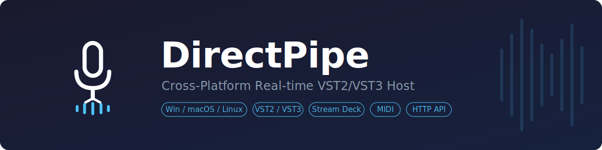
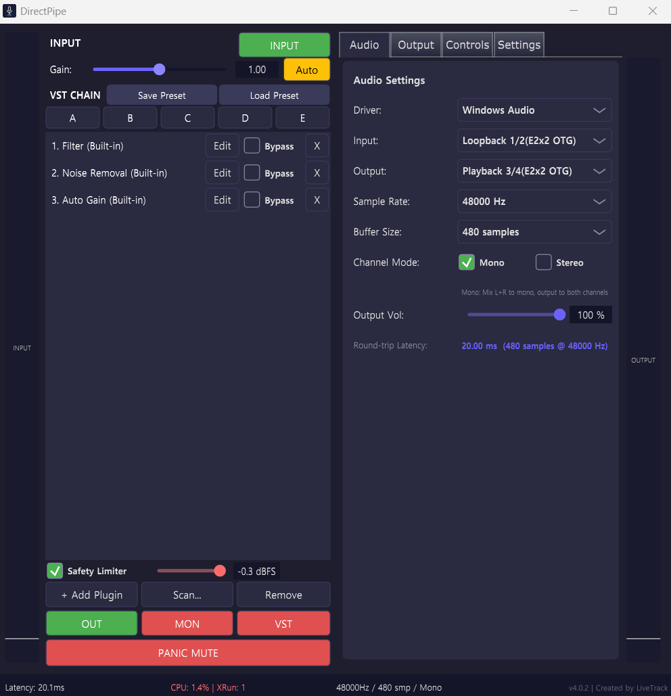

<p align="center">
  
</p>

<p align="center">
  
  
  
  
  
  <br>
  <a href="https://marketplace.elgato.com/product/directpipe-29f7cbb8-cb90-425d-9dbc-b2158e7ea8b3">
    
  </a>
  <a href="https://buymeacoffee.com/livetrack">
    
  </a>
</p>

<h3 align="center">📖 <a href="docs/QUICKSTART.md">Quick Start</a> · <a href="docs/USER_GUIDE.md">User Guide</a> · <a href="#faq">FAQ</a> · 💬 <a href="https://litt.ly/livetrack">Contact</a></h3>

## 다운로드 / Download

- **Latest (최신)**: [v4.0.1 다운로드](https://github.com/LiveTrack-X/DirectPipe/releases/tag/v4.0.1) — 크로스 플랫폼 / Cross-platform (Windows stable, macOS beta, Linux experimental)
- **Previous Stable**: [v3.10.3](https://github.com/LiveTrack-X/DirectPipe/releases/tag/v3.10.3) — Windows 전용 / Windows only

> **참고**: Windows는 안정(Stable), macOS는 베타, Linux는 실험적입니다. macOS/Linux 빌드는 실기기 테스트가 제한적입니다.
> **Note**: Windows is stable, macOS is beta, Linux is experimental. macOS/Linux builds have limited real-hardware testing.

<p align="center">
  <em>DirectPipe is a modern lightweight VST host for applying studio-quality effects to your microphone.</em>
</p>

**스트리머, 팟캐스터, 게이머, 보이스챗 사용자를 위한** 크로스 플랫폼 실시간 마이크 프로세서.

USB 마이크에 노이즈 제거, EQ, 컴프레서 등 VST 플러그인을 걸어 실시간으로 처리하고, Discord · Zoom · OBS 등에 깨끗한 음성을 바로 전달한다. **VST 플러그인을 모르셔도 [Auto] 버튼 하나로 AI 노이즈 제거 + 자동 볼륨 조절 + 저주파 필터가 즉시 적용됩니다.** 방송 중에도 Stream Deck 버튼 하나로 이펙트 전환, 볼륨 조절, 뮤트가 가능하며, 게임 중에는 단축키로, MIDI 컨트롤러로도 조작할 수 있다. DAW 없이도 전문적인 마이크 세팅을 간편하게 구성하고, 상황별 프리셋(A~E)으로 즉시 전환할 수 있다.

**Cross-platform real-time microphone processor for streamers, podcasters, gamers, and voice chat users.**

Apply VST plugins (noise removal, EQ, compressor, etc.) to your USB mic and deliver clean audio directly to Discord, Zoom, or OBS. **Don't know VST plugins? Just click the [Auto] button — AI noise removal + auto volume leveling + low-cut filter are applied instantly.** Switch effects, adjust volume, and mute with a single Stream Deck button while live — or use hotkeys during gameplay, MIDI controllers for hands-on mixing. Set up a professional mic chain without a DAW, and instantly switch between situation presets (A-E).

> **Platform support**: Windows (WASAPI/ASIO), macOS (CoreAudio), Linux (ALSA/JACK). Windows는 안정 빌드, macOS는 베타, Linux는 실험적 지원.
> Windows is the stable release. macOS is in beta. Linux support is experimental.

<p align="center">
  
</p>

**DirectPipe는 누구를 위한 건가요? / Who is DirectPipe for?**

> VST 플러그인을 몰라도 괜찮습니다. **[Auto] 버튼 하나로 기본적인 마이크 보정이 완료됩니다.** 더 세밀한 조정은 VST 플러그인으로.
> Don't know what VST plugins are? No problem. **One click on [Auto] handles the essential mic correction.** Fine-tune further with VST plugins.

🎙 **스트리머 / Streamers**
OBS로 방송하면서 Stream Deck으로 실시간 이펙트 제어. **[Auto] 한 번이면 노이즈 제거 + 볼륨 안정화 완료.** Receiver VST2로 가상 케이블 없이 OBS 직접 연결.
Control effects live with Stream Deck while streaming to OBS. **One click on [Auto] = noise removal + volume leveling done.** Direct OBS connection via Receiver VST2, no virtual cable needed.

🎧 **팟캐스터 / Podcasters**
**[Auto]로 노이즈 제거 + EQ + 볼륨 조절을 한 번에 설정**, 매번 자동 적용. 녹음 기능 내장.
**[Auto] sets up noise removal + EQ + volume leveling in one click**, auto-applied every time. Built-in recording.

🎮 **게이머 / Gamers**
단축키(Ctrl+Shift)로 게임 중 뮤트/프리셋 전환. **[Auto] 켜두면 키보드·팬 소리 자동 제거.** 시스템 트레이 상주, 리소스 최소 사용.
Mute/preset switch with hotkeys (Ctrl+Shift) during gameplay. **Leave [Auto] on and keyboard/fan noise is removed automatically.** Runs in system tray, minimal resource usage.

💬 **보이스챗 / Voice Chat (Discord, Zoom, Google Meet)**
**[Auto] 클릭 한 번으로 깨끗한 음성 완성.** 가상 오디오 케이블로 Discord/Zoom에 전달. Windows: [VB-Cable](https://vb-audio.com/Cable/), macOS: [BlackHole](https://existential.audio/blackhole/)/[Loopback](https://rogueamoeba.com/loopback/), Linux: PipeWire/JACK.
**One click on [Auto] = clean voice ready.** Route to Discord/Zoom via virtual audio cable. Windows: VB-Cable, macOS: BlackHole/Loopback, Linux: PipeWire/JACK.

### 30초 만에 시작하기 / Get Started in 30 Seconds

> 아래 3단계만 따라하면 바로 깨끗한 마이크 음질을 들을 수 있습니다.
> Follow these 3 steps to hear cleaner audio from your mic right away.

1. **다운로드 & 실행** — [최신 버전 다운로드](https://github.com/LiveTrack-X/DirectPipe/releases/latest) → 압축 해제 → 실행 / [Download latest](https://github.com/LiveTrack-X/DirectPipe/releases/latest) → Extract → Run
2. **마이크 선택** — Audio 탭 → Input에서 USB 마이크 선택 / Audio tab → Select your USB mic as Input
3. **[Auto] 클릭** — 기본적인 마이크 보정(노이즈 제거 + 자동 볼륨 + 저주파 필터)이 즉시 적용! / Click [Auto] — Essential mic correction (noise removal + auto volume + low-cut filter) applied instantly!
4. **끝!** 더 자세한 설정은 [Quick Start 가이드](docs/QUICKSTART.md) 참조 / **Done!** For detailed setup, see the [Quick Start guide](docs/QUICKSTART.md)

---

### DirectPipe를 써야 하는 이유 / Why DirectPipe?

> DAW 없이, 설치 없이, 마이크에 VST를 거는 가장 가벼운 방법
> — The lightest way to apply VST effects to your mic, without a DAW or installer.

- **설치 불필요** — Windows: 단일 .exe, macOS: .app 번들, Linux: 단일 바이너리. 인스톨러 없음 — Windows: single .exe, macOS: .app bundle, Linux: single binary. No installer needed
- **5종 외부 제어** — 핫키 · MIDI · Stream Deck · HTTP · WebSocket을 한 프로그램에서 — All 5 control methods in one app
- **프리셋 즉시 전환** — A-E 슬롯, 이름 지정, 끊김 없는 교체 — Named preset slots (A-E) with seamless switching
- **VST 출력 (DirectPipe Receiver, VST2/VST3/AU)** — 가상 케이블 없이 OBS/DAW 직접 연결 — Direct OBS/DAW connection without virtual cables
- **오픈소스** — GPL v3, 누구나 기여 가능 — Open source, community-driven

### For Setup Helpers / 세팅 도우미를 위한 기능

> 다른 사람의 마이크 세팅을 대신 해주는 분들을 위한 워크플로우
> — Workflow for people who set up microphones for others

1. **포터블 실행** — USB에 DirectPipe를 넣고 상대방 컴퓨터에서 바로 실행 ([`portable.flag`로 설정도 USB에 저장](docs/USER_GUIDE.md#포터블-모드--portable-mode))
2. **프리셋 내보내기** — 최적화된 VST 체인을 `.dppreset` 파일로 내보내서 전달
3. **프리셋 가져오기** — 상대방이 슬롯 우클릭 → Import로 즉시 적용
4. **Full Backup** — Settings > Maintenance에서 설정 + 모든 슬롯을 `.dpfullbackup` 하나로 백업/복원. 같은 OS끼리만 복원 가능 (백업 파일에 플랫폼 정보 포함, 다른 OS에서 복원 시 차단) / Same-OS restore only (backup includes platform info, cross-OS restore is blocked)

```
세팅 도우미 PC                          스트리머 PC
DirectPipe → 슬롯 A 세팅 완료          DirectPipe 설치
→ 우클릭 "Export A" → game.dppreset    → 우클릭 "Import to A" → game.dppreset
→ 파일 전달 (메신저, USB 등)            → 즉시 적용!
```

---

<table>
<tr>
<td width="80" align="center">
  <a href="https://marketplace.elgato.com/product/directpipe-29f7cbb8-cb90-425d-9dbc-b2158e7ea8b3">
    
  </a>
</td>
<td>
  <b>🎛 Stream Deck Plugin — <a href="https://marketplace.elgato.com/product/directpipe-29f7cbb8-cb90-425d-9dbc-b2158e7ea8b3">Elgato Marketplace에서 무료 설치</a></b><br>
  Bypass · Volume (SD+ 다이얼) · Preset · Monitor · Panic Mute · Recording · VST Output · Performance Monitor · Plugin Parameter (SD+) · Preset Bar (SD+) — 10가지 액션으로 Stream Deck에서 DirectPipe를 완전 제어<br>
  <sub>Free on Elgato Marketplace — 10 actions to fully control DirectPipe from your Stream Deck</sub>
</td>
</tr>
</table>

---

## 동작 원리 / How It Works

```
Mic ─→ WASAPI / ASIO / CoreAudio / ALSA ─→ Input Gain ─→ VST2/VST3 Plugin Chain ─→ Safety Limiter ─┐
                                                                                          │
                 ┌────────────────────────────────────────────────────────────────────────┼────────────────────┐
                 │                                                                        │                    │
           Main Output                                                             Monitor Output        VST Output
     (Audio tab Output device)                             (Output tab, separate   (DirectPipe Receiver)
     예: Virtual Cable → Discord/Zoom                          별도 장치 → Headphones)   → Shared Memory
                 │                                                                      │
           AudioRecorder                                                    OBS / DAW [DirectPipe Receiver]
           → WAV File (Output tab)

External Control:
  Hotkeys / MIDI CC / Stream Deck / HTTP (:8766) / WebSocket (:8765)
    → ActionDispatcher → Bypass, Volume, Preset, Mute, Recording, VST Output ...
```

## 주요 기능 / Features

### VST 호스팅 / VST Hosting

- **VST2 + VST3** 플러그인 로드 및 인라인 실시간 처리 — Load and process plugins inline in real time
- **드래그 앤 드롭** 플러그인 체인 편집 — Drag & drop to reorder plugins, toggle bypass, open native plugin GUIs
- **Out-of-process 스캐너** — 별도 프로세스에서 안전 스캔. 크래시 시 자동 재시도 (10회), 블랙리스트 자동 등록 — Scans in a separate process; auto-retry up to 10 times, blacklists crashed plugins
- **플러그인 검색/정렬** — 스캐너에서 이름/벤더/포맷으로 실시간 검색 및 컬럼 정렬 — Real-time search and column sort by name, vendor, or format
- **Quick Preset Slots (A-E)** — 5개 체인 전용 프리셋. 이름 지정 가능 (A|게임, B|토크 등). 같은 체인이면 즉시 전환, 다른 체인이면 비동기 로딩 (Keep-Old-Until-Ready: 로딩 중에도 이전 체인이 오디오 처리를 유지하여 끊김 없이 전환). 슬롯 내보내기/가져오기, 우클릭으로 복사/삭제/이름변경 — 5 chain-only presets with custom naming (A|Game, B|Talk). Instant or async switching (Keep-Old-Until-Ready). Right-click to rename, copy, export/import, or delete slots

### 오디오 / Audio

- **WASAPI Shared + ASIO** (Windows), **CoreAudio** (macOS), **ALSA/JACK** (Linux) — 런타임 전환 가능 — Runtime driver switching
- 비독점 마이크 접근 — Non-exclusive mic access, other apps can use the mic simultaneously
- **장치 자동 재연결** — USB 장치 분리 시 알림, 원하는 장치가 다시 연결될 때까지 무기한 대기 후 자동 복구 (SR/BS/채널 설정 보존, 다른 장치로 폴백하지 않음). 모니터 장치도 독립적으로 재연결 — Auto-reconnection on USB disconnect: waits indefinitely for desired device (no fallback), auto-recovers preserving SR/BS/channel settings. Monitor device reconnects independently
- **3가지 출력 경로** — Main Output (Audio 탭 장치) + Monitor Output (Output 탭, 별도 오디오 장치로 헤드폰 모니터링) + VST Output (DirectPipe Receiver → OBS/DAW) — Three output paths: main, monitor headphones (via separate audio device), VST output to OBS/DAW
- **Mono / Stereo** 채널 모드 — 모노 모드: 입력단에서 전체 채널을 합산 후 양쪽 스테레오로 출력. 단일 마이크 사용 시 볼륨 손실 없음 — Mono mode: sums all input channels at the input stage and outputs to both L/R. No volume loss for single-mic use
- **입력 게인** — 0.0x~2.0x 범위, 기본값 1.0x (unity gain) — Input gain 0.0x-2.0x, default 1.0x
- **실시간 레벨 미터** — 입력(좌) / 출력(우) RMS 미터, dB 로그 스케일 — Input/output RMS meters with dB log scale
- **Safety Limiter** — VST 체인 이후 전역 피드포워드 리미터. 기본 ceiling -0.3 dBFS, 예기치 않은 클리핑 방지 — Global feed-forward limiter after VST chain. Default ceiling -0.3 dBFS, prevents unexpected clipping
- **Built-in Processors** — Filter (HPF+LPF), Noise Removal (RNNoise AI), Auto Gain (LUFS AGC) — VST 플러그인과 함께 체인에 삽입 가능. [Auto] 버튼(입력 게인 옆 특수 프리셋 슬롯)으로 3개 모두 한 번에 추가 — Filter, Noise Removal (RNNoise AI), Auto Gain (LUFS AGC) insertable alongside VST plugins. [Auto] button (special preset slot next to input gain) adds all 3 at once
- **Clock Drift Compensation** — Bidirectional IPC drift handling with hysteresis dead-band for stable long-duration streaming (auto buffer management prevents clicks/pops) / 히스테리시스 데드 밴드를 포함한 양방향 IPC 클록 드리프트 보상으로 장시간 스트리밍 안정성 보장 (자동 버퍼 관리로 끊김/팝 방지)

### 외부 제어 / External Control

- **키보드 단축키** (모두 Controls > Hotkeys 탭에서 변경 가능, 드래그앤드롭 순서 변경) — All customizable in Controls > Hotkeys tab, drag-and-drop reorder. macOS에서는 접근성 권한 필요 (CGEventTap). macOS requires Accessibility permission.

  | 단축키 / Shortcut | 동작 / Action |
  |---|---|
  | Ctrl+Shift+M | 패닉 뮤트 / Panic mute |
  | Ctrl+Shift+0 | 마스터 Bypass (전체 체인) / Master bypass |
  | Ctrl+Shift+1–3 | 플러그인 1-3 Bypass 토글 / Plugin 1-3 bypass |
  | Ctrl+Shift+F6 | 입력 뮤트 (= 패닉 뮤트) / Input mute (= Panic Mute) |
  | Ctrl+Shift+H | 모니터 토글 / Monitor toggle |
  | Ctrl+Shift+F1–F5 | 프리셋 슬롯 A-E / Preset slot A-E |

  > 모든 단축키는 Controls > Hotkeys 탭에서 변경/추가 가능 / All shortcuts are customizable in Controls > Hotkeys tab

- **MIDI CC** — Learn 모드로 CC/노트 매핑 (Cancel 버튼으로 취소 가능). 플러그인 파라미터 직접 매핑도 지원 — CC/note mapping with Learn mode (Cancel button to abort). Direct plugin parameter mapping supported
- **WebSocket** (RFC 6455, port 8765) — 양방향 실시간 통신, 상태 자동 푸시 — Bidirectional real-time communication with auto state push
- **HTTP REST API** (port 8766) — curl이나 브라우저에서 원샷 GET 커맨드 — One-shot GET commands from curl or browser
- **UDP Discovery** (port 8767) — Stream Deck 자동 연결용 디스커버리 브로드캐스트 — Auto-discovery broadcast for instant Stream Deck connection
- **[Stream Deck 플러그인](https://marketplace.elgato.com/product/directpipe-29f7cbb8-cb90-425d-9dbc-b2158e7ea8b3)** — 10가지 액션: Bypass, Volume (SD+ 다이얼), Preset, Monitor, Panic Mute, Recording, IPC Toggle, Performance Monitor, Plugin Parameter (SD+ 다이얼), Preset Bar (SD+) — [Elgato Marketplace에서 무료 설치](https://marketplace.elgato.com/product/directpipe-29f7cbb8-cb90-425d-9dbc-b2158e7ea8b3)

### VST 출력 (DirectPipe Receiver) / VST Output (DirectPipe Receiver)

- **DirectPipe Receiver (VST2/VST3/AU)** — OBS, DAW 등에서 공유 메모리로 직접 수신. **가상 케이블 불필요**. 입력 버스 없는 출력 전용 플러그인 (모노/스테레오 출력 지원) — OBS 필터 체인의 앞단 오디오는 무시되고 DirectPipe에서 전송된 오디오만 출력. 호스트에 버퍼링 레이턴시 보고 — Receive audio via shared memory in OBS, DAWs, and other hosts. **No virtual cable needed**. Output-only plugin (no input bus, mono/stereo output) — ignores upstream audio in the host's filter chain, only outputs audio sent from DirectPipe. Reports buffering latency to host
- **VST 출력 토글** — 기본값 OFF. VST 버튼 / Output 탭 체크박스 / Ctrl+Shift+I / MIDI / Stream Deck / HTTP API로 켜기/끄기 — Off by default. Toggle via VST button, Output tab, hotkey, MIDI, Stream Deck, or HTTP
- **버퍼 크기 설정** — Receiver 플러그인 GUI에서 5단계 프리셋 선택. 실제 지연(ms)은 샘플레이트에 따라 다름 — 5 buffer presets in Receiver plugin GUI. Actual latency (ms) depends on sample rate

  | 프리셋 / Preset | 샘플 / Samples | @48kHz | @44.1kHz | 용도 / Best for |
  |---|---|---|---|---|
  | Ultra Low | 256 | ~5ms | ~6ms | 최소 지연 / Minimum latency |
  | Low (기본) | 512 | ~10ms | ~12ms | 일반 사용 / General use (default) |
  | Medium | 1024 | ~21ms | ~23ms | 안정적 / Stable |
  | High | 2048 | ~42ms | ~46ms | CPU 여유 적을 때 / Low CPU headroom |
  | Safe | 4096 | ~85ms | ~93ms | 최대 안정성 / Maximum stability |
- **샘플레이트 불일치 경고** — DirectPipe 송신 샘플레이트와 OBS(호스트) 샘플레이트가 다르면 Receiver GUI에 경고 표시. 샘플레이트가 다르면 피치/속도 변동 발생 — Sample rate mismatch warning shown in Receiver GUI when source and host sample rates differ

### 녹음 / Recording

- **오디오 녹음** — Output 탭에서 VST 체인 이후 처리된 오디오를 WAV로 녹음 (lock-free 실시간 안전) — Record post-chain audio to WAV in Output tab (lock-free, RT-safe)
- **기본 폴더**: `Documents/DirectPipe Recordings` (사용자 문서 폴더), 파일명: `DirectPipe_YYYYMMDD_HHMMSS.wav` — Default folder (user Documents), naming format
- **녹음 제어** — REC/STOP 버튼, 경과 시간 표시, Play (마지막 녹음 재생), Open Folder, 폴더 변경 — REC/STOP, elapsed time, Play last, Open Folder, change folder
- **외부 제어** — Stream Deck (경과 시간 표시), HTTP API, WebSocket으로도 녹음 토글 가능 — Also controllable via Stream Deck (shows elapsed time), HTTP, WebSocket

### UI / 사용자 인터페이스

- **2컬럼 레이아웃** — 좌: 입력 미터 + 게인 + VST 체인 + 프리셋 슬롯 + 뮤트 버튼(OUT/MON/VST) + PANIC MUTE, 우: 설정 탭 패널 + 출력 미터 — Left: input meter + chain + controls, Right: tabbed settings + output meter
- **4개 탭** — Tab layout:
  - **Audio**: 드라이버 선택 (Windows: WASAPI/ASIO, macOS: CoreAudio, Linux: ALSA/JACK), 입출력 장치, 샘플레이트, 버퍼 크기, 채널 모드. **Audio 탭의 샘플레이트가 VST 체인·모니터 출력·IPC 전체에 적용됨** — Driver (Windows: WASAPI/ASIO, macOS: CoreAudio, Linux: ALSA/JACK), devices, SR, buffer, channel mode. **Audio tab SR applies to VST chain, monitor output, and IPC**
  - **Output**: 모니터 출력(장치/볼륨/상태), VST 출력 토글, 녹음(REC/Play/폴더) — Monitor output, VST output toggle, recording
  - **Controls**: 3개 서브탭 — Hotkeys / MIDI / Stream Deck — 3 sub-tabs
  - **Settings**: 자동 시작 (Windows: "Start with Windows", macOS: "Start at Login", Linux: "Start on Login"), 설정 저장/불러오기(.dpbackup, 설정만), 로그 뷰어, 유지보수(Full Backup/Restore — 같은 OS끼리만, Clear Cache/Presets, Factory Reset(A-E + Auto 슬롯 포함)) — Auto-start (platform-adaptive label), settings save/load (.dpbackup, settings only), log viewer, maintenance (Full Backup/Restore — same OS only, Clear Cache/Presets, Factory Reset (includes A-E + Auto slots))
- **시스템 트레이** — X 버튼 = 트레이 최소화. 더블클릭 복원, 우클릭 메뉴(Show/Start with Windows/Quit). 툴팁에 현재 상태 표시 — Tray resident, tooltip shows current state
- **Panic Mute** — 전체 출력 즉시 뮤트 + 녹음 자동 중지, 해제 시 이전 상태 복원 (녹음은 자동 재시작 안 함). 패닉 중 모든 액션 및 외부 제어 잠금 — Instant mute all + auto-stop recording, locks all actions and controls until unmuted (recording does not auto-restart)
- **상태 바** — 레이턴시, CPU %, 오디오 포맷, 포터블 모드, 버전 정보. 오류/경고/정보 알림 자동 표시 (3-8초 페이드) — Status bar: latency, CPU, format, portable mode, version. Auto-fade notifications
- **인앱 자동 업데이트** — 새 버전 감지 시 credit 라벨에 "NEW vX.Y.Z" 표시. 클릭하면 [Update Now] / [View on GitHub] / [Later] 다이얼로그. Update Now로 GitHub에서 다운로드 → 자동 교체 → 재시작 — In-app auto-updater with one-click update from GitHub releases
- **한국어/CJK 폰트 지원** — 한글, 中文, 日本語 장치명 정상 표시. Malgun Gothic Bold로 가독성 확보 — Korean/Chinese/Japanese device names rendered correctly with CJK font support
- **다크 테마** — Custom JUCE LookAndFeel
- **포터블 모드** — exe 옆에 [`portable.flag`](tools/portable.flag) 파일 배치 시 설정을 `./config/`에 저장. 다중 인스턴스 지원: 일반 모드와 포터블을 동시에 실행하면 포터블은 "Audio Only" 모드로 동작 (외부 제어 충돌 방지). 트레이/타이틀 바에 모드 표시 ([상세 설명](docs/USER_GUIDE.md#포터블-모드--portable-mode)) — Place [`portable.flag`](tools/portable.flag) next to exe to store config in `./config/`. Multi-instance support: running portable alongside normal mode puts portable in "Audio Only" mode (prevents external control conflicts). Mode shown in tray/title bar ([details](docs/USER_GUIDE.md#포터블-모드--portable-mode))

## 사용 예시: 가상 케이블로 Discord/OBS에 보이스 이펙트 적용 / Usage: Voice Effects with Virtual Cable

USB 마이크에 VST 이펙트(노이즈 제거, 디에서, EQ 등)를 걸고, 처리된 오디오를 Discord·Zoom·OBS 등 다른 앱에서 마이크로 인식시키려면 가상 오디오 케이블이 필요하다.

To apply VST effects (noise removal, de-esser, EQ, etc.) to a USB mic and route the processed audio as a virtual microphone to apps like Discord, Zoom, or OBS, you need a virtual audio cable.

**플랫폼별 가상 오디오 케이블 / Virtual Audio Cable by Platform:**
| 플랫폼 / Platform | 추천 / Recommended | 비용 / Cost |
|---|---|---|
| **Windows** | [VB-Audio Virtual Cable](https://vb-audio.com/Cable/) | 무료 / Free |
| **macOS** | [BlackHole](https://existential.audio/blackhole/) | 무료 / Free |
| **macOS** | [Loopback](https://rogueamoeba.com/loopback/) | 유료 / Paid |
| **Linux** | PipeWire (virtual sink) 또는 JACK | 내장 / Built-in |

### 설정 방법 / Setup

1. 가상 오디오 케이블 설치 — Install a virtual audio cable (위 표 참조 / see table above)
2. DirectPipe **Audio** 탭에서 설정 — Configure in DirectPipe Audio tab:
   - **Input**: USB 마이크 선택 — Select your USB microphone
   - **Output**: 가상 케이블 입력 선택 (예: Windows `CABLE Input`, macOS `BlackHole 2ch`) — Select virtual cable input (e.g., Windows `CABLE Input`, macOS `BlackHole 2ch`)
3. Discord/Zoom/OBS 등에서 마이크를 가상 케이블 출력으로 변경 (예: Windows `CABLE Output`, macOS `BlackHole 2ch`) — In your app, set mic to virtual cable output

```
USB Mic → DirectPipe (VST Chain: 노이즈 제거, EQ, 컴프 ...) → Virtual Cable Input
                                                                      ↓
                                                Discord/Zoom/OBS ← Virtual Cable Output
```

4. (선택) **Output** 탭에서 헤드폰 장치를 설정하면 처리된 자신의 목소리를 실시간으로 모니터링 가능 — Optionally configure headphone monitoring in the Output tab

> **Tip**: [VoiceMeeter](https://vb-audio.com/Voicemeeter/) (Windows) 등 다른 가상 오디오 장치도 동일하게 사용 가능. Output 장치만 바꾸면 된다. — Any virtual audio device works; just change the Output device.

### OBS에서 VST 출력으로 직접 연결 (가상 케이블 불필요) / Direct OBS Connection via VST Output (No Virtual Cable)

OBS에서는 Receiver VST2 플러그인을 사용하면 가상 케이블 없이 더 간단하게 설정할 수 있습니다.

If you use OBS, the Receiver VST2 plugin offers a simpler setup without any virtual cable.

1. Receiver 플러그인 파일을 VST2 폴더에 복사 — Copy the Receiver plugin to a VST2 folder:
   - **Windows**: `DirectPipe Receiver.dll` → `C:\Program Files\VSTPlugins\` (권장), `C:\Program Files\Common Files\VST2\`, 또는 `C:\Program Files\Steinberg\VstPlugins\`
   - **macOS**: `DirectPipe Receiver.vst` → `/Library/Audio/Plug-Ins/VST/` 또는 `~/Library/Audio/Plug-Ins/VST/`
   - **Linux**: `DirectPipe Receiver.so` → `/usr/lib/vst/` 또는 `~/.vst/`
2. DirectPipe에서 **VST** 버튼 클릭 (VST 출력 켜기) — Enable VST output in DirectPipe
3. OBS → 오디오 소스 (ex.기존 마이크)→ 필터 → VST 2.x 플러그인 → **DirectPipe Receiver** 선택 — Add VST filter in OBS

```
USB Mic → DirectPipe (VST Chain: 노이즈 제거, EQ, 컴프 ...)
      ↓ VST 출력 (공유 메모리, 가상 케이블 불필요)
OBS [DirectPipe Receiver VST 필터] → 방송/녹화
```

> **Tip**: 가상 케이블과 DirectPipe Receiver를 **동시에** 사용할 수도 있습니다. Discord는 가상 케이블로, OBS는 Receiver로 각각 보내면 됩니다. — You can use both methods simultaneously: virtual cable for Discord, DirectPipe Receiver for OBS.

> **중요**: DirectPipe Receiver는 **입력 버스가 없는 출력 전용 플러그인**입니다. OBS 오디오 소스(마이크 캡처 등)의 오디오나 앞단 필터의 오디오는 완전히 무시되고, DirectPipe에서 IPC로 전송된 처리 완료 오디오만 출력됩니다.
>
> **Important**: DirectPipe Receiver is an **output-only plugin with no input bus**. Audio from the OBS source (mic capture, etc.) or preceding filters is completely ignored — only the processed audio sent from DirectPipe via IPC is output.

### 출력별 개별 제어 활용 / Independent Output Control

가상 케이블(Discord) + Receiver VST2(OBS)를 동시 사용하면 **OUT/VST 버튼으로 각 앱의 마이크를 개별 제어**할 수 있습니다. — Using virtual cable (Discord) + Receiver VST2 (OBS) together lets you **independently control each app's mic feed with OUT/VST buttons**.

```
USB Mic → DirectPipe (Plugin Chain)
    ├─ OUT → Virtual Cable → Discord  ← OUT 버튼으로 개별 뮤트
    ├─ VST → Receiver VST2 → OBS     ← VST 버튼으로 개별 뮤트
    └─ MON → Headphones              ← MON 버튼으로 개별 뮤트
```

- **VST OFF / OUT ON** → OBS 방송 마이크만 뮤트, Discord 통화 유지 — Mute OBS mic only, keep Discord
- **OUT OFF / VST ON** → Discord만 뮤트, OBS 방송 마이크 유지 — Mute Discord only, keep OBS
- **Ctrl+Shift+M (Panic Mute)** → 전체 즉시 뮤트, 해제 시 이전 상태 복원 — Kill all outputs instantly, auto-restore on unmute

자세한 활용 예시는 [User Guide — 활용 가이드](docs/USER_GUIDE.md#활용-가이드--usage-guide) 참조.

---

## 빌드 / Build

```bash
cmake -B build -DCMAKE_BUILD_TYPE=Release
cmake --build build --config Release
```

자세한 내용은 [Build Guide](docs/BUILDING.md) 참조 / See Build Guide for details.

### 요구 사항 / Requirements

**Windows:**
- Windows 10/11 (64-bit)
- Visual Studio 2022 (C++ Desktop Development)
- CMake 3.22+
- ASIO SDK (`thirdparty/asiosdk/`) — ASIO 모드 사용 시 / for ASIO driver support (optional)

**macOS (beta):**
- macOS 10.15+ (Catalina 이상)
- Xcode 14+ (Command Line Tools)
- CMake 3.22+

**Linux (experimental):**
- GCC 9+ 또는 Clang 10+
- CMake 3.22+
- ALSA/JACK 개발 패키지 / ALSA/JACK development packages (`libasound2-dev`, `libjack-jackd2-dev`)
- X11 개발 패키지 / X11 development packages

**공통 / Common:**
- JUCE 7.0.12 (CMake FetchContent 자동 다운로드 / auto-fetched)
- VST2 SDK (`thirdparty/VST2_SDK/`) — VST2 포맷 사용 시 (optional)

## 프로젝트 구조 / Project Structure

```
host/                     JUCE host application (main)
  Source/
    ActionResult.h          Typed success/failure return value
    Audio/                  AudioEngine, VSTChain, OutputRouter, MonitorOutput,
                            AudioRingBuffer, LatencyMonitor, AudioRecorder,
                            SafetyLimiter, BuiltinFilter, BuiltinNoiseRemoval,
                            BuiltinAutoGain
    Control/                ActionDispatcher, ActionHandler, SettingsAutosaver,
                            ControlManager, ControlMapping,
                            WebSocketServer, HttpApiServer,
                            HotkeyHandler, MidiHandler, StateBroadcaster,
                            DirectPipeLogger
    IPC/                    SharedMemWriter
    Platform/               Cross-platform abstractions
      Windows/                Registry autostart, Named Mutex, Win32 priority
      macOS/                  LaunchAgent, CGEventTap hotkeys, pthread QoS
      Linux/                  XDG autostart, setpriority, InterProcessLock
    UI/                     AudioSettings, OutputPanel, ControlSettingsPanel,
                            HotkeyTab, MidiTab, StreamDeckTab,
                            PresetSlotBar, StatusUpdater, UpdateChecker,
                            PluginChainEditor, PluginScanner, PresetManager,
                            LevelMeter, LogPanel, NotificationBar,
                            DirectPipeLookAndFeel, SettingsExporter,
                            FilterEditPanel, NoiseRemovalEditPanel, AGCEditPanel
core/                     IPC library (RingBuffer, SharedMemory, Protocol)
plugins/receiver/         Receiver VST2/VST3/AU plugin (for OBS/DAW)
com.directpipe.directpipe.sdPlugin/  Stream Deck plugin (Node.js, SDK v3)
dist/                     Packaged plugin (.streamDeckPlugin) + marketplace assets
tests/                    Unit tests (Google Test)
thirdparty/               VST2 SDK, ASIO SDK (not included), RNNoise (BSD-3, included)
```

## 문서 / Documentation

- **[Quick Start](docs/QUICKSTART.md) — USB 마이크 5분 설정 가이드 / 5-minute USB mic setup guide**
- [Platform Guide](docs/PLATFORM_GUIDE.md) — 플랫폼별 가이드 (Windows/macOS/Linux) / Platform-specific setup, features, and limitations
- [Release Notes](docs/ReleaseNote.md) — 변경 이력 / Changelog and version history
- [Architecture](docs/ARCHITECTURE.md) — 시스템 설계 / System design, data flow, thread safety
- [Build Guide](docs/BUILDING.md) — 빌드 가이드 (멀티 플랫폼) / Build instructions for all platforms
- [User Guide](docs/USER_GUIDE.md) — 사용법 / Setup and usage
- [Control API](docs/CONTROL_API.md) — WebSocket / HTTP API 레퍼런스 / API reference
- [API Examples](docs/API_EXAMPLES.md) — 자동화 예제 (Python, AutoHotkey, OBS 연동, curl, PowerShell) / Automation examples
- [Stream Deck Guide](docs/STREAMDECK_GUIDE.md) — Stream Deck 플러그인 / Stream Deck integration
- [Logging Rules](docs/LOGRULE.md) — 로깅 형식 및 규칙 / Log format, categories, and audit mode

## FAQ

<details>
<summary><b>X 버튼을 눌렀는데 프로그램이 꺼지지 않아요 / Clicking X doesn't close the app</b></summary>

DirectPipe는 **시스템 트레이**에서 상주하는 앱입니다. X 버튼(닫기)을 누르면 **종료되는 것이 아니라 트레이로 최소화**됩니다. 오디오 처리는 백그라운드에서 계속 동작합니다.

- **트레이 아이콘 더블클릭** → 창 복원
- **트레이 아이콘 우클릭** → 메뉴에서 **"Quit DirectPipe"** 선택 → 완전 종료

이 동작은 의도된 설계입니다 — Discord나 OBS 등에 실시간 오디오를 계속 보내면서 창을 닫아도 처리가 중단되지 않도록 합니다.

---

DirectPipe is a **system tray** resident app. Clicking the X (close) button **minimizes it to the tray** instead of quitting. Audio processing continues running in the background.

- **Double-click the tray icon** → restore the window
- **Right-click the tray icon** → select **"Quit DirectPipe"** → fully exit

This is by design — it ensures audio processing keeps running for Discord, OBS, etc. even when the window is closed.
</details>

<details>
<summary><b>트레이 아이콘이 안 보여요 / 트레이에 고정하는 방법 / Tray icon not visible / How to pin to tray</b></summary>

Windows는 기본적으로 트레이 아이콘을 숨김 영역(▲ 화살표 안)에 넣습니다. DirectPipe 아이콘을 항상 보이게 하려면 **트레이에 고정**하세요.

**Windows 11:**
1. **설정** → **개인 설정** → **작업 표시줄** → **기타 시스템 트레이 아이콘** 클릭
2. 목록에서 **DirectPipe**를 찾아 **켬** 으로 변경
3. 또는: 숨김 영역(▲)에서 DirectPipe 아이콘을 **작업 표시줄로 드래그**

**Windows 10:**
1. **설정** → **개인 설정** → **작업 표시줄** → **알림 영역** → **작업 표시줄에 표시할 아이콘 선택** 클릭
2. 목록에서 **DirectPipe**를 찾아 **켬** 으로 변경
3. 또는: 숨김 영역(▲)에서 DirectPipe 아이콘을 **작업 표시줄로 드래그**

**macOS:** 메뉴 바에 자동으로 표시됩니다. 메뉴 바 아이콘이 너무 많으면 Cmd 키를 누른 채 아이콘을 드래그하여 순서를 변경하세요.

**Linux:** 데스크톱 환경에 따라 다릅니다. GNOME은 AppIndicator 확장, KDE는 시스템 트레이에 자동 표시됩니다.

---

Windows hides tray icons in the overflow area (▲ arrow) by default. To keep the DirectPipe icon always visible, **pin it to the taskbar tray**.

**Windows 11:**
1. **Settings** → **Personalization** → **Taskbar** → click **Other system tray icons**
2. Find **DirectPipe** and toggle it **On**
3. Or: drag the DirectPipe icon from the overflow area (▲) onto the **taskbar**

**Windows 10:**
1. **Settings** → **Personalization** → **Taskbar** → **Notification area** → click **Select which icons appear on the taskbar**
2. Find **DirectPipe** and toggle it **On**
3. Or: drag the DirectPipe icon from the overflow area (▲) onto the **taskbar**

**macOS:** Appears automatically in the menu bar. If crowded, hold Cmd and drag to reorder menu bar icons.

**Linux:** Depends on desktop environment. GNOME requires AppIndicator extension; KDE shows in system tray automatically.
</details>

<details>
<summary><b>처음 실행할 때 보안 경고가 떠요 / Security warning on first run</b></summary>

정상입니다! DirectPipe는 오픈소스라 코드 서명 인증서가 없어서 나타나는 경고입니다. 악성 소프트웨어가 아닙니다.

**Windows (SmartScreen):**
1. **"추가 정보"** 텍스트를 클릭하세요
2. 아래에 나타나는 **"실행"** 버튼을 누르세요

**macOS (Gatekeeper):**
1. **시스템 설정** → **개인 정보 보호 및 보안** → 하단의 **"확인 없이 열기"** 클릭
2. 또는: Finder에서 DirectPipe.app을 **우클릭** → **열기** → **열기** 클릭

한 번만 하면 이후로는 경고 없이 실행됩니다.

---

This is normal! DirectPipe is open-source and does not have a code signing certificate, so your OS shows a warning. It is not malware.

**Windows (SmartScreen):**
1. Click the **"More info"** text
2. Click the **"Run anyway"** button that appears

**macOS (Gatekeeper):**
1. **System Settings** → **Privacy & Security** → click **"Open Anyway"** at the bottom
2. Or: Right-click DirectPipe.app in Finder → **Open** → click **Open**

You only need to do this once — the warning won't appear again.
</details>

<details>
<summary><b>VST 플러그인이 뭔가요? 어디서 구하나요? / What are VST plugins and where to get them?</b></summary>

VST 플러그인은 오디오에 효과를 추가하는 소프트웨어입니다. 노이즈 제거, EQ, 컴프레서 등 다양한 종류가 있습니다.

**무료 추천 플러그인:**
- [ReaPlugs](https://www.reaper.fm/reaplugs/) — EQ, 컴프레서, 게이트 등 기본 플러그인 모음 (무료)
- [RNNoise](https://github.com/werman/noise-suppression-for-voice) — AI 기반 실시간 노이즈 제거 (무료)
- [TDR Nova](https://www.tokyodawn.net/tdr-nova/) — 고품질 다이나믹 EQ (무료)
- [OrilRiver](https://www.kvraudio.com/product/orilriver-by-denis-tihanov) — 리버브 (무료)

설치 후 DirectPipe에서 **"Scan..."** 버튼으로 플러그인 폴더를 스캔하면 목록에 나타납니다.

---

VST plugins are software that add audio effects to your signal — noise removal, EQ, compressor, reverb, and more.

**Free recommended plugins:**
- [ReaPlugs](https://www.reaper.fm/reaplugs/) — EQ, compressor, gate, and more essentials (free)
- [RNNoise](https://github.com/werman/noise-suppression-for-voice) — AI-powered real-time noise removal (free)
- [TDR Nova](https://www.tokyodawn.net/tdr-nova/) — High-quality dynamic EQ (free)
- [OrilRiver](https://www.kvraudio.com/product/orilriver-by-denis-tihanov) — Reverb (free)

After installing plugins, click **"Scan..."** in DirectPipe to scan your plugin folders. They will appear in the plugin list.
</details>

<details>
<summary><b>Discord / Zoom / OBS에서 처리된 마이크를 쓰려면? / How to use with Discord, Zoom, or OBS?</b></summary>

가상 오디오 케이블이 필요합니다. Windows: [VB-Cable](https://vb-audio.com/Cable/) (무료), macOS: [BlackHole](https://existential.audio/blackhole/) (무료) 또는 [Loopback](https://rogueamoeba.com/loopback/), Linux: PipeWire virtual sink 또는 JACK.

**설정 순서:**
1. 가상 오디오 케이블을 설치 (Windows: VB-Cable 설치 후 재부팅, macOS: BlackHole 설치, Linux: PipeWire/JACK 설정)
2. DirectPipe **Audio** 탭:
   - **Input** → 내 USB 마이크 선택
   - **Output** → 가상 케이블 입력 선택 (예: Windows `CABLE Input`, macOS `BlackHole 2ch`)
3. Discord/Zoom/OBS 음성 설정:
   - **마이크** → 가상 케이블 출력 선택 (예: Windows `CABLE Output`, macOS `BlackHole 2ch`)
4. 자기 목소리를 확인하려면 **Output** 탭에서 헤드폰 장치를 설정하세요

```
내 USB 마이크 → DirectPipe (노이즈 제거, EQ 등) → Virtual Cable Input
                                                         ↓
                                       Discord/Zoom/OBS ← Virtual Cable Output (마이크로 인식)
```

---

You need a virtual audio cable. Windows: [VB-Cable](https://vb-audio.com/Cable/) (free), macOS: [BlackHole](https://existential.audio/blackhole/) (free) or [Loopback](https://rogueamoeba.com/loopback/), Linux: PipeWire virtual sink or JACK.

**Setup steps:**
1. Install a virtual audio cable (Windows: VB-Cable + reboot, macOS: BlackHole, Linux: configure PipeWire/JACK)
2. In DirectPipe **Audio** tab:
   - **Input** → Select your USB microphone
   - **Output** → Select virtual cable input (e.g., Windows `CABLE Input`, macOS `BlackHole 2ch`)
3. In Discord / Zoom / OBS voice settings:
   - **Microphone** → Select virtual cable output (e.g., Windows `CABLE Output`, macOS `BlackHole 2ch`)
4. To hear yourself, configure your headphone device in the **Output** tab

```
USB Mic → DirectPipe (Noise removal, EQ, etc.) → Virtual Cable Input
                                                        ↓
                                      Discord/Zoom/OBS ← Virtual Cable Output (recognized as mic)
```
</details>

<details>
<summary><b>소리가 안 나와요 / 마이크가 인식이 안 돼요 / No sound or mic not detected</b></summary>

**확인 순서:**
1. **Audio 탭** → Input 장치가 올바르게 선택되어 있는지 확인
2. 왼쪽 **INPUT 레벨 미터**가 움직이는지 확인 → 움직이면 마이크 입력은 정상
3. 레벨 미터가 움직이지 않으면:
   - **Windows**: 설정 → 개인 정보 → 마이크에서 앱 접근이 허용되어 있는지 확인
   - **macOS**: 시스템 설정 → 개인 정보 보호 및 보안 → 마이크에서 DirectPipe 허용
   - **Linux**: PulseAudio/PipeWire 볼륨 설정에서 입력 장치 확인
   - 다른 앱(Discord 등)이 마이크를 독점 모드로 사용 중이면 해제
4. **OUT** 버튼이 초록색인지 확인 (빨간색이면 뮤트 상태 → 클릭해서 해제)
5. **PANIC MUTE**가 활성화되어 있으면 다시 클릭해서 해제

---

**Troubleshooting steps:**
1. **Audio tab** → Make sure the correct Input device is selected
2. Check if the left **INPUT level meter** is moving → if it moves, mic input is working
3. If the level meter doesn't move:
   - **Windows**: Settings → Privacy → Microphone — make sure app access is allowed
   - **macOS**: System Settings → Privacy & Security → Microphone — allow DirectPipe
   - **Linux**: Check input device in PulseAudio/PipeWire volume settings
   - If another app (e.g., Discord) is using the mic in exclusive mode, disable exclusive mode
4. Check that the **OUT** button is green (red means muted → click to unmute)
5. If **PANIC MUTE** is active, click it again to deactivate
</details>

<details>
<summary><b>소리가 끊기거나 지연이 커요 / Audio crackling or high latency</b></summary>

**Buffer Size를 조절하세요:**
- Audio 탭 → **Buffer Size**: 값을 낮추면 지연이 줄지만 CPU 부담 증가
  - `256 samples` (약 5ms @ 48kHz) — 일반적인 시작점
  - `128 samples` (약 2.7ms) — 낮은 지연, 고사양 PC 권장
  - `512 samples` (약 10ms) — 안정적, 저사양 PC 권장

**그래도 끊긴다면:**
- 플러그인 수를 줄이거나, CPU를 많이 쓰는 플러그인을 Bypass 처리
- 오디오 인터페이스가 있다면 **ASIO** 드라이버 사용 (Windows, 더 낮은 지연 가능)
- 하단 상태 바의 **CPU %** 수치를 확인 — 60% 이상이면 과부하
- 하단 상태 바의 **XRun** 수치를 확인 — 1분간 버퍼 언더런 횟수 표시
- **Windows Audio (Low Latency)** 모드에서 끊긴다면 → **Windows Audio**로 변경 시도 (FAQ의 드라이버 가이드 참조)
- **macOS**: CoreAudio 기본 버퍼 크기 조절 (Audio MIDI Setup에서도 확인 가능)
- **Linux**: JACK 사용 시 `jackd` 설정에서 period/nperiods 조절

---

**Adjust the Buffer Size:**
- Audio tab → **Buffer Size**: lower values reduce latency but increase CPU load
  - `256 samples` (~5ms @ 48kHz) — good starting point
  - `128 samples` (~2.7ms) — low latency, recommended for higher-end PCs
  - `512 samples` (~10ms) — stable, recommended for lower-end PCs

**Still crackling?**
- Reduce the number of plugins, or Bypass CPU-heavy ones
- If you have an audio interface, switch to **ASIO** driver (Windows, allows even lower latency)
- Check the **CPU %** in the bottom status bar — above 60% indicates overload
- Check the **XRun** count in the status bar — shows buffer underruns in the last 60 seconds
- **Windows**: If crackling in **Windows Audio (Low Latency)** → try switching to **Windows Audio** (see Driver Guide FAQ)
- **macOS**: Adjust CoreAudio buffer size (also configurable in Audio MIDI Setup)
- **Linux**: With JACK, tune `jackd` period/nperiods settings
</details>

<details>
<summary><b>오디오 드라이버 종류와 선택 가이드 / Audio Driver Types & Selection Guide</b></summary>

DirectPipe는 플랫폼별로 다른 오디오 드라이버를 지원합니다. Audio 탭의 **Driver** 드롭다운에서 선택할 수 있습니다.

- **Windows**: 5가지 드라이버 (아래 상세 설명)
- **macOS**: **CoreAudio** — macOS 기본 오디오 시스템. 추가 설정 없이 자동 동작, 충분히 낮은 지연
- **Linux**: **ALSA** (기본) 또는 **JACK** (저지연) — JACK 사용 시 `jackd` 실행 필요

DirectPipe supports different audio drivers per platform. Select from the **Driver** dropdown in the Audio tab.

- **Windows**: 5 driver types (detailed below)
- **macOS**: **CoreAudio** — macOS native audio system. Works automatically with low latency, no extra setup
- **Linux**: **ALSA** (default) or **JACK** (low latency) — JACK requires running `jackd`

**Windows 드라이버 상세 / Windows Driver Details:**

### DirectSound (레거시 / Legacy)

Windows XP 시절의 오디오 API입니다. JUCE가 자동으로 등록하며 목록에 표시되지만, **WASAPI보다 지연이 크고 기능이 제한적이므로 사용할 이유가 없습니다.**

Legacy audio API from the Windows XP era. JUCE registers it automatically, but **it has higher latency and fewer features than WASAPI — there is no reason to use it.**

- **지연 / Latency**: 50-100ms+ (가장 높음 / highest)
- **버퍼 제어 / Buffer control**: 제한적 / Limited
- **다른 앱 동시 사용 / Shared access**: O
- **추천 / Recommended for**: 사용하지 마세요. **Windows Audio**를 쓰세요 / Don't use this. Use **Windows Audio**

### Windows Audio -- 추천 / Recommended

Windows WASAPI 공유 모드. 다른 앱과 동시에 같은 장치를 사용할 수 있습니다. **대부분의 사용자에게 가장 안정적인 선택입니다.**

Windows WASAPI shared mode. Other apps can use the same device simultaneously. **The most reliable choice for most users.**

- **지연 / Latency**: 3-10ms (버퍼 크기에 따라 / depends on buffer size)
- **버퍼 제어 / Buffer control**: 144 samples (~3ms @ 48kHz)부터 선택 가능 / Selectable from 144 samples
- **다른 앱 동시 사용 / Shared access**: O
- **추천 / Recommended for**: 대부분의 사용자, USB 마이크 사용자 / Most users, USB mic users

### Windows Audio (Low Latency)

WASAPI 공유 모드이면서 저지연. Windows 10 1607+ 에서 IAudioClient3를 사용해 최소 주기(period)로 동작합니다.

Low-latency shared WASAPI mode. Uses IAudioClient3 on Windows 10 1607+ for minimum audio periods.

- **지연 / Latency**: 하드웨어에 따라 다름 / Varies by hardware
- **버퍼 제어 / Buffer control**: 하드웨어가 보고한 최소 단위로 세밀 조절 / Fine-grained, hardware-defined steps
- **다른 앱 동시 사용 / Shared access**: O
- **참고 / Note**: USB 마이크 등 많은 오디오 장치가 IAudioClient3를 제대로 지원하지 않습니다 / Many audio devices (especially USB mics) don't properly support IAudioClient3

> **주의 / Warning**: LL 모드의 실제 성능은 **오디오 드라이버의 IAudioClient3 구현에 전적으로 의존**합니다. 많은 USB 마이크와 일반 오디오 장치의 드라이버는 IAudioClient3의 `GetSharedModeEnginePeriod()`에서 최소/최대/기본 주기를 동일한 값(예: 480 samples = 10ms)으로 보고합니다. 이 경우 **일반 Windows Audio 모드가 오히려 더 낮은 버퍼(144 samples = ~3ms)를 사용할 수 있어 지연이 더 적습니다.** LL 모드에서 버퍼 크기를 변경할 수 없거나 일반 모드보다 높은 지연이 나타난다면, **Windows Audio**를 사용하세요.
>
> **Warning**: LL mode performance **depends entirely on your audio driver's IAudioClient3 implementation**. Many USB mics and generic audio devices report the same value for min/max/default period in `GetSharedModeEnginePeriod()` (e.g., 480 samples = 10ms). In such cases, **standard Windows Audio mode can actually achieve lower buffers (144 samples = ~3ms) and thus lower latency.** If you can't change the buffer size in LL mode or see higher latency than standard mode, use **Windows Audio** instead.

### Windows Audio (Exclusive Mode)

WASAPI 독점 모드. 해당 장치를 앱이 독점하므로 다른 앱의 소리가 나지 않습니다.

WASAPI exclusive mode. The app takes exclusive control of the device -- other apps cannot output sound.

- **지연 / Latency**: 10-20ms
- **버퍼 제어 / Buffer control**: 앱이 직접 제어 / App-controlled
- **다른 앱 동시 사용 / Shared access**: **X** (독점 / exclusive)
- **추천 / Recommended for**: 녹음 전용 환경 / Dedicated recording setups
- **참고 / Note**: Windows 사운드 설정 > 장치 속성 > "앱이 이 기기를 독점적으로 제어" 체크 필요 / Enable "Allow apps to take exclusive control" in Windows Sound settings

### ASIO

전문가용 저지연 드라이버. 오디오 인터페이스의 네이티브 ASIO 드라이버가 필요합니다.

Professional low-latency driver. Requires native ASIO driver from your audio interface.

- **지연 / Latency**: 2-5ms (가장 낮음 / lowest)
- **버퍼 제어 / Buffer control**: ASIO Control Panel에서 세밀 조절 / Fine control via ASIO Control Panel
- **다른 앱 동시 사용 / Shared access**: 장치에 따라 다름 / Depends on device
- **추천 / Recommended for**: 전문가, 오디오 인터페이스 사용자 / Pros, audio interface users

### Windows 비교 요약 / Windows Driver Comparison

| | DirectSound | Windows Audio | Low Latency | Exclusive Mode | ASIO |
|---|---|---|---|---|---|
| 지연 / Latency | 50-100ms+ | **3-10ms** | 드라이버 의존 / Driver-dependent | 10-20ms | **2-5ms** |
| 다른 앱 동시 / Shared | O | O | O | X | - |
| 버퍼 세밀도 / Buffer granularity | 제한적 / Limited | 보통 / Moderate | 드라이버 의존 / Driver-dependent | 보통 / Moderate | **세밀 / Fine** |
| 호환성 / Compatibility | 모든 장치 / All | **모든 장치 / All devices** | 제한적 / Limited | 대부분 / Most | 전용 드라이버 / Driver needed |
| 설치 / Setup | 없음 / None | 없음 / None | 없음 / None | 없음 / None | 드라이버 필요 / Driver needed |
| 추천 / Recommended | X | **O** | 장치에 따라 / Depends | 녹음 전용 / Recording | 전문가 / Pro |

### 선택 가이드 / Quick Selection Guide

**Windows:**
1. **USB 마이크 사용자** -> **Windows Audio** 사용 (가장 안정적, 충분히 낮은 지연) / Use Windows Audio (most reliable, low enough latency)
2. **오디오 인터페이스가 있다면** -> **ASIO** 사용 (최저 지연) / Use ASIO (lowest latency)
3. **LL 모드를 시도해봤는데 버퍼 변경이 안 되거나 지연이 높다면** -> **Windows Audio**로 돌아가세요 / If LL mode doesn't allow buffer changes or has higher latency, go back to Windows Audio
4. **녹음 전용 PC라면** -> **Windows Audio (Exclusive Mode)** 도 고려 / Consider Exclusive Mode

**macOS:** CoreAudio 하나만 사용 (추가 선택 불필요) / CoreAudio is the only option (no driver selection needed)

**Linux:** 일반 사용은 ALSA, 저지연이 필요하면 JACK 사용 / Use ALSA for general use, JACK for low latency
</details>

<details>
<summary><b>플러그인 스캔 중 프로그램이 멈춘 것 같아요 / Plugin scan seems stuck</b></summary>

플러그인 스캔은 **별도 프로세스**에서 실행되므로 DirectPipe가 멈추거나 크래시하지 않습니다. 일부 플러그인은 스캔에 시간이 오래 걸릴 수 있습니다 (최대 5분).

- 크래시를 유발하는 플러그인은 자동으로 **블랙리스트**에 등록되어 다음 스캔에서 건너뜁니다
- 스캔 로그 확인: Windows `%AppData%/DirectPipe/scanner-log.txt`, macOS `~/Library/Application Support/DirectPipe/scanner-log.txt`, Linux `~/.config/DirectPipe/scanner-log.txt`

---

Plugin scanning runs in a **separate process**, so DirectPipe itself will never freeze or crash. Some plugins may take a while to scan (up to 5 minutes).

- Plugins that cause crashes are automatically **blacklisted** and skipped in future scans
- Scan log: Windows `%AppData%/DirectPipe/scanner-log.txt`, macOS `~/Library/Application Support/DirectPipe/scanner-log.txt`, Linux `~/.config/DirectPipe/scanner-log.txt`
</details>

<details>
<summary><b>프리셋은 어떻게 사용하나요? / How to use presets?</b></summary>

**Quick Preset Slots (A–E):**
- 현재 플러그인 체인과 설정을 **A–E** 슬롯에 저장할 수 있습니다
- 슬롯 버튼 **(A/B/C/D/E)** 클릭 → 비어있으면 현재 상태 저장, 차있으면 해당 슬롯 로드
- 같은 플러그인이면 파라미터만 바꿔서 **즉시 전환**, 다른 플러그인이면 **비동기 로딩** (프리로딩 캐시로 끊김 없이 즉시 전환)
- 슬롯 **우클릭** → **이름 변경** (예: `A|게임`), **복제**, **삭제**, **내보내기/가져오기** (`.dppreset`)
- **Save/Load** 버튼으로 .dppreset 파일에 프리셋 저장/불러오기 가능

예: 게임 중엔 **A|게임** (노이즈 제거만), 노래방에선 **B|노래** (리버브 + 컴프레서)

---

**Quick Preset Slots (A–E):**
- Save your current plugin chain and settings to slots **A through E**
- Click a slot button **(A/B/C/D/E)** → saves current state if empty, loads slot if occupied
- If the plugins are the same, only parameters change (**instant switch**); different plugins use **async loading** (preloading cache enables seamless instant switching)
- **Right-click** slot → **Rename** (e.g., `A|Game`), **Copy**, **Delete**, **Export/Import** (`.dppreset`)
- Use **Save/Load** buttons to save/load presets as .dppreset files

Example: Slot **A|Game** for gaming (noise removal only), Slot **B|Karaoke** for karaoke (reverb + compressor)
</details>

<details>
<summary><b>Monitor 출력은 뭔가요? / What is Monitor output?</b></summary>

**Monitor**는 자기 목소리를 헤드폰으로 실시간 확인하는 기능입니다. VST 이펙트가 적용된 자신의 목소리를 들을 수 있습니다.

- **Output** 탭에서 헤드폰이 연결된 오디오 장치를 선택
- Main Output과는 별도의 오디오 장치를 사용하므로 **독립적으로 동작** (Windows: WASAPI, macOS: CoreAudio)
- **MON** 버튼으로 켜기/끄기

> **지연(레이턴시) 참고**: 모니터 출력은 메인 오디오와 별도의 오디오 장치를 사용하기 때문에 **~15-20ms의 추가 지연**이 발생합니다. 이 지연은 듀얼 디바이스 구조의 한계입니다. 자기 목소리를 지연 없이 듣고 싶다면 **ASIO 드라이버 사용** (Windows, 입출력이 하나의 디바이스로 처리됨) 또는 오디오 인터페이스의 **하드웨어 다이렉트 모니터링** 기능을 권장합니다.

---

**Monitor** lets you hear your own processed voice through headphones in real-time, with all VST effects applied.

- Select your headphone device in the **Output** tab
- Uses a separate audio device from the Main Output, so it **works independently** (Windows: WASAPI, macOS: CoreAudio)
- Toggle on/off with the **MON** button

> **Latency note**: Monitor output uses a separate audio device, which adds **~15-20ms of extra latency** due to the dual-device architecture. For zero-latency monitoring, use an **ASIO driver** (Windows only, single device handles both input and output) or your audio interface's **hardware direct monitoring** feature.
</details>

<details>
<summary><b>컴퓨터 시작할 때 자동으로 실행되게 하려면? / How to auto-start at login?</b></summary>

두 가지 방법:
1. **시스템 트레이** 아이콘 우클릭 → 자동 시작 체크
2. **Settings** 탭 → 자동 시작 체크

라벨은 플랫폼별로 다릅니다: Windows "Start with Windows", macOS "Start at Login", Linux "Start on Login".

활성화하면 로그인 시 자동으로 트레이에서 실행됩니다. X 버튼으로 창을 닫아도 트레이에 남아서 계속 동작합니다.

- **Windows**: 레지스트리 (`HKCU\...\Run`)
- **macOS**: LaunchAgent (`~/Library/LaunchAgents/`)
- **Linux**: XDG autostart (`~/.config/autostart/`)

---

Two ways to enable:
1. Right-click the **system tray** icon → check the auto-start toggle
2. **Settings** tab → check the auto-start toggle

The label adapts to your platform: Windows "Start with Windows", macOS "Start at Login", Linux "Start on Login".

Once enabled, DirectPipe launches automatically at login. Closing the window (X button) minimizes it to the tray — it keeps running in the background.

- **Windows**: Registry (`HKCU\...\Run`)
- **macOS**: LaunchAgent (`~/Library/LaunchAgents/`)
- **Linux**: XDG autostart (`~/.config/autostart/`)
</details>

<details>
<summary><b>Stream Deck 플러그인은 어디서 받나요? / Where to get the Stream Deck plugin?</b></summary>

**[Elgato Marketplace에서 무료 설치](https://marketplace.elgato.com/product/directpipe-29f7cbb8-cb90-425d-9dbc-b2158e7ea8b3)** — Stream Deck 앱에서 바로 설치됩니다.

**[Install free from Elgato Marketplace](https://marketplace.elgato.com/product/directpipe-29f7cbb8-cb90-425d-9dbc-b2158e7ea8b3)** — Installs directly into the Stream Deck app.

지원 액션 (10종): Bypass Toggle, Volume Control (SD+ 다이얼), Preset Switch, Monitor Toggle, Panic Mute, Recording Toggle, IPC Toggle, Performance Monitor, Plugin Parameter (SD+ 다이얼), Preset Bar (SD+ 터치스크린)

Supported actions (10): Bypass Toggle, Volume Control (SD+ dial), Preset Switch, Monitor Toggle, Panic Mute, Recording Toggle, IPC Toggle, Performance Monitor, Plugin Parameter (SD+ dial), Preset Bar (SD+ touchscreen)
</details>

<details>
<summary><b>Stream Deck 없이도 외부 제어가 되나요? / Can I control without a Stream Deck?</b></summary>

네! 다양한 방법으로 제어할 수 있습니다:

Yes! Multiple control methods are available:

| 방법 / Method | 예시 / Example | 적합한 용도 / Best for |
|---|---|---|
| **키보드 단축키 / Hotkeys** | Ctrl+Shift+1–9 bypass, F1–F5 프리셋 / presets | 가장 간편 / Simplest |
| **MIDI CC** | 미디 컨트롤러 노브/버튼 / MIDI controller knobs | 실시간 볼륨 조절 / Real-time volume |
| **HTTP API** | `curl http://localhost:8766/api/...` | 스크립트 자동화 / Script automation |
| **WebSocket** | ws://localhost:8765 | 커스텀 앱/봇 연동 / Custom app integration |

자세한 내용 / Details: [Control API](docs/CONTROL_API.md)
</details>

<details>
<summary><b>DirectPipe Receiver 플러그인이 뭔가요? / What is the DirectPipe Receiver plugin?</b></summary>

**DirectPipe Receiver**는 DirectPipe에서 처리한 마이크 오디오를 **OBS, DAW 등**에서 직접 받을 수 있게 해주는 플러그인입니다. VST2, VST3, AU 포맷으로 제공됩니다 (OBS는 VST2만 지원).

보통 DirectPipe에서 처리된 오디오를 OBS로 보내려면 가상 오디오 케이블 (VB-Cable, BlackHole 등)이 필요합니다. DirectPipe Receiver를 사용하면 **가상 케이블 없이** 공유 메모리(IPC)를 통해 오디오를 직접 받을 수 있어 설정이 더 간단하고 지연도 적습니다.

---

**DirectPipe Receiver** is a plugin that lets **OBS, DAWs, and other hosts** receive DirectPipe's processed mic audio directly. Available in VST2, VST3, and AU formats (OBS only supports VST2).

Normally, to route DirectPipe's processed audio to OBS, you need a **virtual audio cable** (VB-Cable, BlackHole, etc.). With the DirectPipe Receiver, you can receive audio directly via shared memory (IPC) — **no virtual cable needed**, simpler setup, lower latency.

**DirectPipe Receiver vs. Virtual Cable 비교 / Comparison:**

| | DirectPipe Receiver | 가상 오디오 케이블 / Virtual Audio Cable |
|---|---|---|
| 설치 / Install | Receiver 플러그인을 VST/AU 폴더에 복사 / Copy plugin to VST/AU folder | 가상 케이블 설치 (VB-Cable/BlackHole 등) / Install virtual cable |
| 설정 / Setup | OBS/DAW에서 플러그인 필터 추가만 하면 됨 / Just add plugin filter in OBS/DAW | DirectPipe Output + OBS Input 양쪽 설정 필요 / Configure both sides |
| 지연 / Latency | ~5–85ms (프리셋 선택 가능) / Configurable | 드라이버에 의존 / Depends on driver |
| 추가 소프트웨어 / Extra software | 불필요 / None needed | 가상 케이블 필요 (VB-Cable/BlackHole 등) / Virtual cable required |
| 호환성 / Compatibility | VST2/VST3/AU 지원 앱 / VST2/VST3/AU-capable apps | 모든 앱 / Any app |
| 추천 / Recommended for | OBS, DAW 사용자 / OBS, DAW users | Discord, Zoom 등 일반 앱 / General apps |
</details>

<details>
<summary><b>OBS에서 Receiver VST2는 어떻게 사용하나요? / How to use the Receiver VST2 in OBS?</b></summary>

**OBS에서 Receiver VST2 설정하기 (OBS는 VST2만 지원):**

1. **Receiver 플러그인**을 VST2 폴더에 복사
   - **Windows**: `DirectPipe Receiver.dll` → `C:\Program Files\VSTPlugins\` (권장), `C:\Program Files\Common Files\VST2\`, 또는 `C:\Program Files\Steinberg\VstPlugins\`
   - **macOS**: `DirectPipe Receiver.vst` → `/Library/Audio/Plug-Ins/VST/` 또는 `~/Library/Audio/Plug-Ins/VST/`
   - **Linux**: `DirectPipe Receiver.so` → `/usr/lib/vst/` 또는 `~/.vst/`

2. **DirectPipe**에서 IPC 출력 켜기
   - DirectPipe 실행 → 하단의 **VST** 버튼 클릭 (초록색으로 변경)
   - 또는: **Output** 탭에서 **"Enable VST Receiver Output"** 체크
   - 또는: 키보드 **Ctrl+Shift+I**

3. **OBS** 설정
   - OBS 실행 → **소스** 영역에서 오디오 소스(마이크 등) 선택 → **필터** 클릭
   - **"+" 버튼** → **"VST 2.x 플러그인"** 선택
   - 플러그인 목록에서 **"DirectPipe Receiver"** 선택
   - **"플러그인 인터페이스 열기"** 클릭하면 연결 상태와 버퍼 설정 확인 가능

4. **연결 확인**
   - Receiver 플러그인 UI에서 **"Connected"** (초록색 원)이 표시되면 정상
   - "Disconnected" (빨간색)이면 DirectPipe가 실행 중이고 IPC가 켜져 있는지 확인

```
DirectPipe (마이크 + VST 이펙트)
      ↓ IPC (공유 메모리)
OBS [DirectPipe Receiver VST 필터]
      ↓
방송 / 녹화
```

---

**Setting up Receiver VST2 in OBS (OBS only supports VST2):**

1. **Copy the Receiver plugin** to a VST2 folder:
   - **Windows**: `DirectPipe Receiver.dll` → `C:\Program Files\VSTPlugins\` (Recommended), `C:\Program Files\Common Files\VST2\`, or `C:\Program Files\Steinberg\VstPlugins\`
   - **macOS**: `DirectPipe Receiver.vst` → `/Library/Audio/Plug-Ins/VST/` or `~/Library/Audio/Plug-Ins/VST/`
   - **Linux**: `DirectPipe Receiver.so` → `/usr/lib/vst/` or `~/.vst/`

2. **Enable IPC output in DirectPipe**
   - Run DirectPipe → click the **VST** button at the bottom (turns green)
   - Or: **Output** tab → check **"Enable VST Receiver Output"**
   - Or: press **Ctrl+Shift+I**

3. **Configure OBS**
   - Open OBS → select an audio source (e.g., mic) → click **Filters**
   - Click **"+"** → select **"VST 2.x Plug-in"**
   - Choose **"DirectPipe Receiver"** from the plugin list
   - Click **"Open Plug-in Interface"** to verify connection and adjust buffer settings

4. **Verify connection**
   - In the Receiver plugin UI, **"Connected"** with a green circle = working
   - If "Disconnected" (red), check that DirectPipe is running and IPC is enabled

```
DirectPipe (Mic + VST Effects)
      ↓ IPC (Shared Memory)
OBS [DirectPipe Receiver VST Filter]
      ↓
Stream / Recording
```
</details>

<details>
<summary><b>Receiver 플러그인에서 끊김/지연이 있어요 / Audio crackling or latency with DirectPipe Receiver</b></summary>

**버퍼 크기를 조정하세요:**

Receiver 플러그인 UI를 열면 **Buffer** 드롭다운에서 버퍼 크기를 선택할 수 있습니다.

| 프리셋 | 지연 | 권장 상황 |
|---|---|---|
| **Ultra Low** | ~5ms | 실시간 모니터링이 중요할 때 (끊김 가능성 있음) |
| **Low** (기본) | ~10ms | 대부분의 상황에 적합 |
| **Medium** | ~21ms | 안정적인 연결 |
| **High** | ~42ms | CPU 사용량이 높을 때 |
| **Safe** | ~85ms | 끊김이 자주 발생할 때 |

**여전히 끊긴다면:**
- 한 단계 높은 버퍼 프리셋을 선택하세요
- DirectPipe와 OBS의 **샘플레이트를 동일하게** 맞추세요 (예: 둘 다 48000Hz)
- CPU 사용량을 확인하세요 — DirectPipe 하단 상태 바에서 확인 가능

---

**Adjust the buffer size:**

Open the Receiver plugin interface and select a buffer size from the **Buffer** dropdown.

| Preset | Latency | Recommended for |
|---|---|---|
| **Ultra Low** | ~5ms | When real-time monitoring matters (risk of dropouts) |
| **Low** (default) | ~10ms | Most situations |
| **Medium** | ~21ms | Stable connection |
| **High** | ~42ms | When CPU load is high |
| **Safe** | ~85ms | If you experience frequent dropouts |

**Still getting dropouts?**
- Select a higher buffer preset
- Make sure DirectPipe and OBS use the **same sample rate** (e.g., both at 48000Hz)
- Check CPU usage — visible in DirectPipe's bottom status bar
</details>

<details>
<summary><b>DirectPipe Receiver와 가상 케이블 중 뭘 써야 하나요? / Should I use DirectPipe Receiver or Virtual Cable?</b></summary>

**상황에 따라 다릅니다:**

**DirectPipe Receiver를 추천하는 경우:**
- **OBS**에서 DirectPipe 오디오를 사용하는 경우 (OBS는 VST2 지원)
- **DAW**에서 DirectPipe 오디오를 받아 추가 처리하는 경우 (VST3/AU 사용 가능)
- 가상 오디오 케이블을 설치하고 싶지 않은 경우
- 설정을 최소화하고 싶은 경우

**가상 오디오 케이블을 추천하는 경우 (VB-Cable/BlackHole/PipeWire):**
- **Discord, Zoom, Google Meet** 등 VST 플러그인을 지원하지 않는 앱에서 사용하는 경우
- 여러 앱에서 동시에 DirectPipe 오디오를 사용해야 하는 경우
- OBS 이외의 앱에서도 가상 마이크가 필요한 경우

**둘 다 동시에 사용 가능합니다!**
- DirectPipe Output → 가상 케이블 (Discord/Zoom용)
- DirectPipe IPC → Receiver VST2 (OBS용)
- 이렇게 하면 Discord에는 가상 케이블로, OBS에는 DirectPipe Receiver로 동시에 오디오를 보낼 수 있습니다

---

**Depends on your use case:**

**Use DirectPipe Receiver when:**
- Using DirectPipe audio in **OBS** (OBS supports VST2)
- Using DirectPipe audio in a **DAW** (VST3/AU available)
- Don't want to install virtual audio cable software
- Want minimal setup

**Use a virtual audio cable (VB-Cable/BlackHole/PipeWire) when:**
- Using apps that **don't support VST plugins** (Discord, Zoom, Google Meet, etc.)
- Need to use DirectPipe audio in multiple apps simultaneously
- Need a virtual microphone for non-OBS apps

**You can use both at the same time!**
- DirectPipe Output → Virtual cable (for Discord/Zoom)
- DirectPipe IPC → Receiver VST2 (for OBS)
- This lets you send audio to Discord via virtual cable and to OBS via DirectPipe Receiver simultaneously
</details>

<details>
<summary><b>IPC 출력(VST 버튼)은 뭔가요? 켜야 하나요? / What is IPC Output (VST button)? Do I need to enable it?</b></summary>

**IPC(Inter-Process Communication) 출력**은 DirectPipe에서 처리한 오디오를 **공유 메모리**를 통해 다른 프로세스(DirectPipe Receiver 플러그인)에 전달하는 기능입니다.

**기본값은 꺼져(OFF) 있습니다.** 가상 오디오 케이블 (VB-Cable, BlackHole 등)만 사용하는 경우에는 켤 필요가 없습니다.

**켜야 하는 경우:**
- OBS에서 **DirectPipe Receiver VST2** 플러그인을 사용할 때
- 가상 케이블 없이 OBS로 오디오를 직접 보내고 싶을 때

**켜는 방법 (5가지):**
1. DirectPipe 메인 화면 하단의 **VST** 버튼 클릭
2. **Output** 탭 → **"Enable VST Receiver Output"** 체크
3. 키보드 단축키 **Ctrl+Shift+I**
4. Stream Deck **IPC Toggle** 버튼
5. HTTP API: `curl http://localhost:8766/api/ipc/toggle`

켜면 VST 버튼이 **초록색**으로 변하고, 끄면 **빨간색**입니다.

---

**IPC (Inter-Process Communication) Output** sends DirectPipe's processed audio to another process (the DirectPipe Receiver plugin) via **shared memory**.

**It's OFF by default.** If you only use a virtual audio cable (VB-Cable, BlackHole, etc.), you don't need to enable it.

**Enable it when:**
- Using the **DirectPipe Receiver VST2** plugin in OBS
- Want to route audio to OBS without a virtual cable

**How to enable (5 ways):**
1. Click the **VST** button at the bottom of DirectPipe's main window
2. **Output** tab → check **"Enable VST Receiver Output"**
3. Hotkey **Ctrl+Shift+I**
4. Stream Deck **IPC Toggle** button
5. HTTP API: `curl http://localhost:8766/api/ipc/toggle`

When enabled, the VST button turns **green**; when disabled, it's **red**.
</details>

<details>
<summary><b>업데이트는 어떻게 하나요? / How to update DirectPipe?</b></summary>

DirectPipe는 **인앱 업데이트 알림**을 지원합니다. 새 버전이 있으면 하단 credit 라벨에 **"NEW vX.Y.Z"** 가 주황색으로 표시됩니다.

**Windows**: "Update Now" 버튼으로 자동 다운로드 → exe 교체 → 재시작.
**macOS/Linux**: "View on GitHub" 버튼으로 릴리즈 페이지에서 수동 다운로드.

인터넷이 연결되지 않은 경우에도 기존 버전은 정상적으로 동작합니다.

---

DirectPipe includes **in-app update notification**. When a newer version is available, the bottom credit label shows **"NEW vX.Y.Z"** in orange.

**Windows**: Click "Update Now" for auto-download → replace exe → restart.
**macOS/Linux**: Click "View on GitHub" to manually download from the release page.

If you're offline, the current version continues to work normally.
</details>

<details>
<summary><b>ASIO를 선택했는데 다른 앱에서 소리가 안 나요 / Other apps lose audio when ASIO is selected</b></summary>

ASIO 드라이버는 오디오 장치를 **독점(Exclusive)** 으로 사용합니다. DirectPipe가 ASIO로 오디오 장치를 열면, 다른 앱(Discord, 브라우저 등)이 같은 장치에 접근할 수 없습니다.

**해결 방법:**
1. **WASAPI Shared 사용 (권장)** — Audio 탭 > Driver Type을 "Windows Audio"로 변경. 다른 앱과 장치를 공유할 수 있습니다.
2. **ASIO4ALL 사용** — 여러 장치를 하나의 가상 ASIO 장치로 묶을 수 있지만, 지연이 다소 증가합니다.
3. **전용 오디오 인터페이스 사용** — Focusrite, SSL 등 전용 인터페이스의 ASIO 드라이버는 해당 장치만 독점하므로, 내장 사운드카드는 다른 앱이 사용할 수 있습니다.

---

ASIO drivers use **exclusive access** to the audio device. When DirectPipe opens a device via ASIO, other apps (Discord, browser, etc.) cannot access it.

**Solutions:**
1. **Use WASAPI Shared (recommended)** — Change Driver Type to "Windows Audio" in Audio tab. Shares the device with other apps.
2. **Use ASIO4ALL** — Combines multiple devices into one virtual ASIO device, but adds some latency.
3. **Use a dedicated audio interface** — Focusrite, SSL, etc. Their ASIO driver only locks the interface, leaving the built-in sound card free for other apps.
</details>

<details>
<summary><b>플러그인이 스캔 목록에 안 나와요 (64-bit 전용) / Plugin not showing in scan results (64-bit only)</b></summary>

DirectPipe는 **64-bit VST2/VST3 플러그인만** 지원합니다. 32-bit 플러그인은 표시되지 않습니다.

**체크리스트:**
1. **64-bit인지 확인** — 32-bit 전용 플러그인은 지원되지 않습니다
2. **VST 경로 확인** — Audio 탭 > Scan Plugins > 스캔 경로에 플러그인 폴더가 포함되어 있는지 확인
3. **블랙리스트 확인** — 이전 스캔에서 크래시한 플러그인은 블랙리스트에 등록됩니다. Settings > Clear Plugin Cache로 초기화 후 재스캔
4. **플러그인 재설치** — 간혹 손상된 DLL/VST3 번들은 스캐너가 건너뜁니다

---

DirectPipe only supports **64-bit VST2/VST3 plugins**. 32-bit plugins won't appear.

**Checklist:**
1. **Verify 64-bit** — 32-bit-only plugins are not supported
2. **Check VST paths** — Audio tab > Scan Plugins > verify plugin folder is in scan paths
3. **Check blacklist** — Plugins that crashed during previous scans are blacklisted. Reset via Settings > Clear Plugin Cache, then re-scan
4. **Reinstall plugin** — Corrupted DLL/VST3 bundles may be silently skipped
</details>

<details>
<summary><b>프리셋 전환할 때 소리가 잠깐 끊겨요 / Brief audio gap when switching presets</b></summary>

프리셋 전환 시 **~10-50ms의 매우 짧은 오디오 갭**이 발생할 수 있습니다. 이것은 **Keep-Old-Until-Ready** 메커니즘의 정상 동작입니다 — 새 플러그인 체인이 백그라운드에서 완전히 로드될 때까지 이전 체인이 계속 오디오를 처리하고, 준비가 되면 원자적으로 교체합니다.

이 10-50ms 갭은 v3의 1-3초 무음 갭에서 크게 개선된 것입니다. 프리로드 캐시가 활성화되어 있으면 (다른 슬롯 플러그인을 미리 로드) 더 짧아질 수 있습니다.

---

A **very brief audio gap (~10-50ms)** may occur during preset switches. This is normal **Keep-Old-Until-Ready** behavior — the old plugin chain continues processing audio while the new chain loads in the background, then swaps atomically when ready.

This 10-50ms gap is a major improvement over v3's 1-3 second mute gap. With the preload cache active (pre-loads other slots' plugins), the gap can be even shorter.
</details>

<details>
<summary><b>CPU 사용량이 높아요 / High CPU usage</b></summary>

**원인 진단:**
1. **Performance Monitor 확인** — 상태 바의 CPU % 확인. 70% 이상이면 플러그인 체인 최적화 필요
2. **무거운 플러그인 식별** — 각 플러그인을 하나씩 Bypass하면서 CPU 변화 확인
3. **오버샘플링 확인** — 일부 플러그인(리미터, 이퀄라이저)은 내부 오버샘플링(2x-8x)이 있어 CPU를 크게 사용

**해결 방법:**
- 무거운 플러그인을 더 가벼운 대안으로 교체 (예: FabFilter Pro-Q 3 → TDR Nova)
- 불필요한 플러그인 제거 또는 Bypass
- 버퍼 크기 늘리기 (Audio 탭) — 지연이 증가하지만 CPU 부하 감소
- Auto 모드의 내장 프로세서는 최적화되어 있어 CPU 사용량이 매우 낮음

---

**Diagnosis:**
1. **Check Performance Monitor** — Look at CPU % in status bar. Above 70% means the plugin chain needs optimization
2. **Identify heavy plugins** — Bypass plugins one by one and observe CPU change
3. **Check oversampling** — Some plugins (limiters, EQs) have internal oversampling (2x-8x) that significantly increases CPU

**Solutions:**
- Replace heavy plugins with lighter alternatives (e.g., FabFilter Pro-Q 3 → TDR Nova)
- Remove or Bypass unused plugins
- Increase buffer size (Audio tab) — adds latency but reduces CPU load
- Auto mode's built-in processors are optimized and use very little CPU
</details>

<details>
<summary><b>모니터에서 지연이 느껴져요 / Hearing delay in monitor output</b></summary>

모니터 출력은 메인 출력과 **별도의 오디오 장치**를 사용하므로, 추가 지연이 발생할 수 있습니다.

**원인:**
1. **모니터 장치의 버퍼 크기** — WASAPI Shared 모드는 장치 기본 버퍼를 사용합니다 (보통 10-20ms)
2. **샘플레이트 불일치** — 메인 장치와 모니터 장치의 샘플레이트가 다르면 리샘플링 지연 발생

**해결 방법:**
- 메인 장치와 모니터 장치의 샘플레이트를 일치시키기 (Audio 탭에서 확인)
- ASIO를 사용한다면, 같은 인터페이스의 다른 출력을 모니터로 사용 (추가 장치 불필요)
- 모니터 지연은 자기 목소리 모니터링용이므로, 방송/녹음 품질에는 영향 없음

---

Monitor output uses a **separate audio device** from the main output, which can introduce additional latency.

**Causes:**
1. **Monitor device buffer size** — WASAPI Shared mode uses the device's default buffer (typically 10-20ms)
2. **Sample rate mismatch** — Different sample rates between main and monitor devices cause resampling delay

**Solutions:**
- Match sample rates between main and monitor devices (check in Audio tab)
- If using ASIO, use a different output of the same interface as monitor (no extra device needed)
- Monitor delay only affects self-monitoring; it doesn't affect broadcast/recording quality
</details>

## Star History

<a href="https://www.star-history.com/?repos=LiveTrack-X%2FDirectPipe&type=date&legend=top-left">
 <picture>
   <source media="(prefers-color-scheme: dark)" srcset="https://api.star-history.com/image?repos=LiveTrack-X/DirectPipe&type=date&theme=dark&legend=top-left" />
   <source media="(prefers-color-scheme: light)" srcset="https://api.star-history.com/image?repos=LiveTrack-X/DirectPipe&type=date&legend=top-left" />
   
 </picture>
</a>


## 후원 / Support

프로젝트가 도움이 되셨다면 커피 한 잔 사주세요! / If you find this project useful, consider buying me a coffee!

<a href="https://buymeacoffee.com/livetrack">
  
</a>

## License

GPL v3 — [LICENSE](LICENSE)
